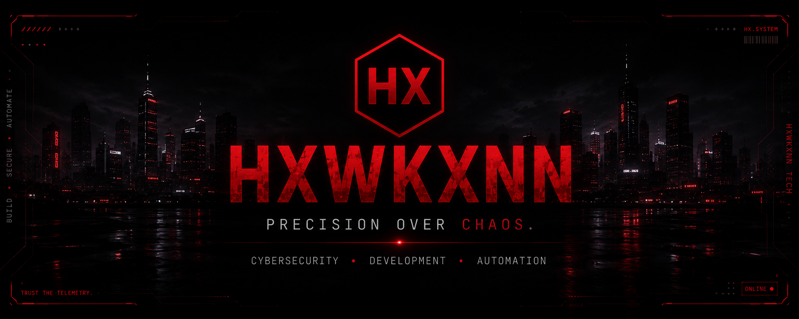
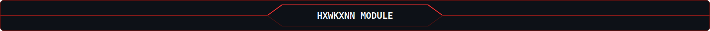

<div align="center">



<br>


<br>

[](https://hxwkxnn.dev)
[](https://instagram.com/hxwkxnn.tech)
[](https://discord.gg/64NehtJ9Jx)
[](https://github.com/HXWKXNN)

</div>


```console
felipe@hxwkxnn:~$ sudo systemctl start profile.service

[sudo] password for visitor: ********

Starting HXWKXNN profile service...

[  OK  ] Loaded identity module
[  OK  ] Loaded featured projects
[  OK  ] Loaded technology stack
[  OK  ] Connected GitHub telemetry
[  OK  ] Loaded roadmap
[  OK  ] Connected contact layer

██████████████████████████████ 100%

hxwkxnn-profile.service is active (running)
System online.
```



<div align="center">

## `MODULE 01 — IDENTITY`

</div>

<table>
<tr>
<td width="58%" valign="top">

### About me

I'm a **Cybersecurity student and developer** focused on practical tools, secure digital solutions and reliable automation.

My main interests are **Blue Team operations, Python development, Discord bots, Windows utilities, system optimization and web development**.

I am building the **HXWKXNN Tech** ecosystem through software, professional services and community projects.

</td>
<td width="42%" valign="top">

### Quick telemetry

```text
NAME........ Felipe
ALIAS....... HXWKXNN
ROLE........ Cybersecurity Student
FOCUS....... Blue Team
BRAND....... HXWKXNN Tech
LOCATION.... Brazil
STATUS...... ONLINE
```

</td>
</tr>
</table>

### Current operations

<table>
<tr>
<td width="20%" align="center"><b>HX Support</b><br><code>ACTIVE</code></td>
<td width="20%" align="center"><b>HX System Manager</b><br><code>BUILDING</code></td>
<td width="20%" align="center"><b>Blue Team</b><br><code>STUDYING</code></td>
<td width="20%" align="center"><b>Automation</b><br><code>DEVELOPING</code></td>
<td width="20%" align="center"><b>Portfolio</b><br><code>EXPANDING</code></td>
</tr>
</table>


<div align="center">

## `MODULE 02 — FEATURED PROJECTS`

</div>

<table>
<tr>
<td width="50%" valign="top">

### 🛡️ HX Support

**Discord support and automation system**

Support, moderation, logging and community automation with persistent data and operational telemetry.

**Stack**

`Python` `discord.py` `SQLite`


</td>
<td width="50%" valign="top">

### ⚙️ HX System Manager

**Windows optimization and privacy suite**

Diagnostics, privacy controls, performance tuning and security-focused Windows management.

**Stack**

`C#` `.NET` `Windows`


</td>
</tr>

<tr>
<td width="50%" valign="top">

### 🌐 HXWKXNN Tech

**Official platform and professional portfolio**

Technology services, projects, multilingual experience and brand ecosystem.

**Stack**

`HTML` `CSS` `JavaScript` `Cloudflare`

[](https://hxwkxnn.dev)

</td>
<td width="50%" valign="top">

### 🚀 PC Optimizer

**Windows diagnostics and optimization toolkit**

Cleanup routines, network tuning, diagnostics, recovery options and gamer-focused optimization.

**Stack**

`Batch` `PowerShell` `Windows Tools`


</td>
</tr>
</table>


<div align="center">

## `MODULE 03 — TECHNOLOGY STACK`

</div>

<table>
<tr>
<td width="25%" valign="top">

### Languages


</td>
<td width="25%" valign="top">

### Development


</td>
<td width="25%" valign="top">

### Security & systems


</td>
<td width="25%" valign="top">

### Tools


</td>
</tr>
</table>


<div align="center">

## `MODULE 04 — GITHUB TELEMETRY`

</div>

### 🔥 Contribution streak

<div align="center">


</div>

### 📈 Activity graph

<div align="center">


</div>

### 🐍 Contribution snake

<div align="center">

<picture>
  <source media="(prefers-color-scheme: dark)" srcset="https://raw.githubusercontent.com/HXWKXNN/HXWKXNN/output/github-contribution-grid-snake-dark.svg">
  <source media="(prefers-color-scheme: light)" srcset="https://raw.githubusercontent.com/HXWKXNN/HXWKXNN/output/github-contribution-grid-snake.svg">
  
</picture>

</div>


<div align="center">

## `MODULE 05 — CURRENT FOCUS`

</div>

```text
[01] Expand HX Support
[02] Develop HX System Manager
[03] Build Blue Team utilities
[04] Improve the HXWKXNN Tech ecosystem
[05] Publish practical cybersecurity projects
[06] Strengthen the professional portfolio
```


<div align="center">

## `MODULE 06 — 2026 ROADMAP`

</div>

```text
HXWKXNN TECH PROGRESS

████████████████░░░░ 80%

[✓] Launch the HXWKXNN Tech website
[✓] Build the HXWKXNN Community
[✓] Develop the HX Support foundation
[✓] Create the PC Optimizer toolkit
[>] Expand HX System Manager
[>] Publish Blue Team utilities
[>] Contribute to open source
[>] Improve the professional portfolio
```


<div align="center">

## `MODULE 07 — CONNECT`

[](https://hxwkxnn.dev)
[](https://discord.gg/64NehtJ9Jx)
[](https://instagram.com/hxwkxnn.tech)

</div>


<table>
<tr>
<td width="20%" align="center"><b>SYSTEM</b><br><code>ONLINE</code></td>
<td width="20%" align="center"><b>NETWORK</b><br><code>CONNECTED</code></td>
<td width="20%" align="center"><b>MISSION</b><br><code>BUILD • SECURE</code></td>
<td width="20%" align="center"><b>MODE</b><br><code>PRECISION</code></td>
<td width="20%" align="center"><b>VERSION</b><br><code>FINAL</code></td>
</tr>
</table>

<div align="center">

### `Trust the telemetry.`

## **Precision over chaos.**

⭐ **Thanks for visiting my profile.**

</div>
