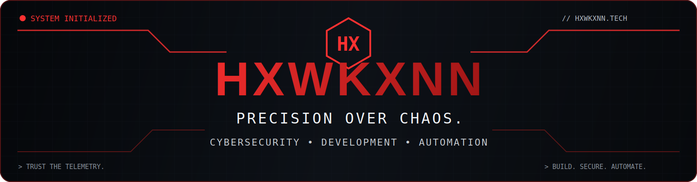

<div align="center">



<br>


<br>

[](https://hxwkxnn.dev)
[](https://instagram.com/hxwkxnn.tech)
[](https://discord.gg/64NehtJ9Jx)
[](https://github.com/HXWKXNN)

</div>


```console
felipe@hxwkxnn:~$ sudo boot profile

[sudo] password for visitor: ********

Authentication successful.

Initializing HXWKXNN Tech...

[ OK ] Identity module
[ OK ] Projects module
[ OK ] Technology stack
[ OK ] GitHub telemetry
[ OK ] Roadmap
[ OK ] Contact layer

██████████████████████████████ 100%

System ready.
```

<div align="center">

## `MODULE 01 — IDENTITY`

</div>

<table>
<tr>
<td width="58%" valign="top">

### About me

I'm a **Cybersecurity student and developer** focused on building practical tools, secure digital solutions and reliable automations.

My main interests are **Blue Team operations, Python development, Discord bots, Windows utilities, system optimization and web development**.

I am currently expanding the **HXWKXNN Tech** ecosystem through software, professional services and community projects.

</td>
<td width="42%" valign="top">

### Quick telemetry

```text
NAME........ Felipe
ALIAS....... HXWKXNN
ROLE........ Cybersecurity Student
FOCUS....... Blue Team
BRAND....... HXWKXNN Tech
LOCATION.... Brazil
STATUS...... ONLINE
```

</td>
</tr>
</table>

### Current operations

- Developing **HX Support**
- Expanding **HX System Manager**
- Studying **Blue Team operations and cybersecurity**
- Building utilities for **automation, optimization and security**
- Improving the **HXWKXNN Tech** platform and portfolio


<div align="center">

## `MODULE 02 — FEATURED PROJECTS`

</div>

<table>
<tr>
<td width="50%" valign="top">

### 🛡️ HX Support

Discord bot focused on support, moderation, logging and community automation.

**Core modules**

- Member and voice logs
- Moderation events
- Service commands
- SQLite persistence
- Community automation

**Stack**

`Python` `discord.py` `SQLite`


</td>
<td width="50%" valign="top">

### ⚙️ HX System Manager

Desktop utility focused on Windows optimization, privacy and system management.

**Core modules**

- System diagnostics
- Privacy controls
- Performance options
- Windows management
- Security-focused utilities

**Stack**

`C#` `.NET` `Windows`


</td>
</tr>

<tr>
<td width="50%" valign="top">

### 🌐 HXWKXNN Tech

Official website, professional portfolio and technology services platform.

**Core modules**

- Service plans
- Professional portfolio
- Multilingual interface
- Brand ecosystem
- Cloudflare infrastructure

**Stack**

`HTML` `CSS` `JavaScript` `Cloudflare`

[](https://hxwkxnn.dev)

</td>
<td width="50%" valign="top">

### 🚀 PC Optimizer

Professional toolkit for Windows maintenance, diagnostics and performance optimization.

**Core modules**

- Cleanup routines
- Network optimization
- System diagnostics
- Gamer-focused tuning
- Recovery and safety options

**Stack**

`Batch` `PowerShell` `Windows Tools`


</td>
</tr>
</table>


<div align="center">

## `MODULE 03 — TECHNOLOGY STACK`

</div>

### Languages


### Web & application development


### Cybersecurity & systems


### Tools & platforms


<div align="center">

## `MODULE 04 — GITHUB TELEMETRY`

</div>

### 🔥 Contribution streak

<div align="center">


</div>

### 📈 Activity graph

<div align="center">


</div>

### 🐍 Contribution snake

<div align="center">

<picture>
  <source media="(prefers-color-scheme: dark)" srcset="https://raw.githubusercontent.com/HXWKXNN/HXWKXNN/output/github-contribution-grid-snake-dark.svg">
  <source media="(prefers-color-scheme: light)" srcset="https://raw.githubusercontent.com/HXWKXNN/HXWKXNN/output/github-contribution-grid-snake.svg">
  
</picture>

</div>


<div align="center">

## `MODULE 05 — CURRENT FOCUS`

</div>

```text
ACTIVE OBJECTIVES

[01] Expand HX Support
[02] Develop HX System Manager
[03] Build Blue Team utilities
[04] Improve the HXWKXNN Tech ecosystem
[05] Publish practical cybersecurity projects
[06] Strengthen the professional portfolio
```


<div align="center">

## `MODULE 06 — 2026 ROADMAP`

</div>

```text
HXWKXNN TECH PROGRESS

████████████████░░░░ 80%

[✓] Launch the HXWKXNN Tech website
[✓] Build the HXWKXNN Community
[✓] Develop the HX Support foundation
[✓] Create the PC Optimizer toolkit
[>] Expand HX System Manager
[>] Publish Blue Team utilities
[>] Contribute to open source
[>] Improve the professional portfolio
```


<div align="center">

## `MODULE 07 — CONNECT`

[](https://hxwkxnn.dev)
[](https://discord.gg/64NehtJ9Jx)
[](https://instagram.com/hxwkxnn.tech)

</div>


```text
SYSTEM STATUS ............ ONLINE
MISSION .................. BUILD • SECURE • IMPROVE
PRIMARY FOCUS ............ CYBERSECURITY
OPERATION MODE ........... PRECISION
BRAND .................... HXWKXNN TECH
VERSION .................. PROFILE V4.0
```

<div align="center">

### `Trust the telemetry.`

## **Precision over chaos.**

⭐ **Thanks for visiting my profile.**

</div>
